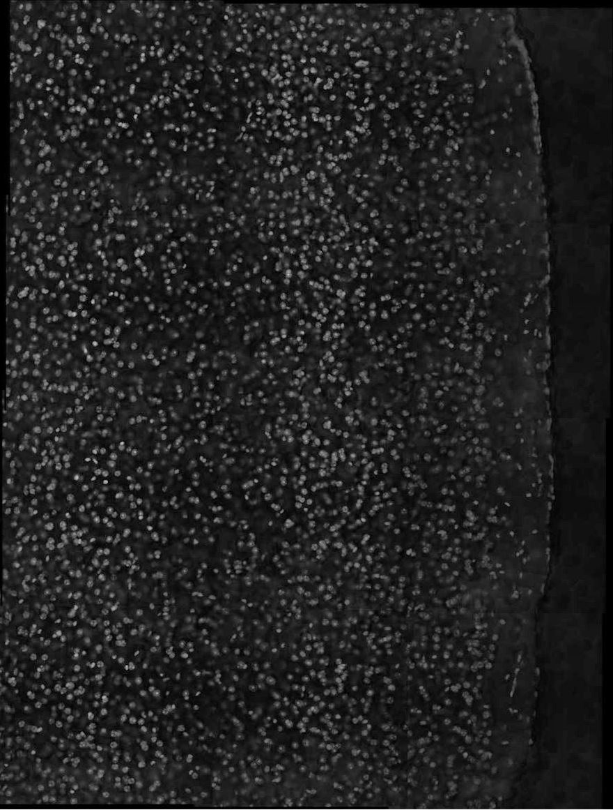

  

<table>
<tr>
<td></td>
<td>Nuclei</td>
<td colspan="2" style="text-align:center;">Cytoplasm</td>
</tr>
  <tr>
    <td></td>
    <td>Dapi</td>
    <td>anti ATPase 10x secondary</td>
    <td>anti cadherin</td>
  </tr>
  <tr>
    <td>3D</td>
    <td>NO</td>
    <td>NO</td>
    <td>NO</td>
  </tr>
    <tr>
    <td>2D + z-stitching</td>
    <td>YES</td>
    <td>YES</td>
    <td>YES</td>
  </tr>
</table>

